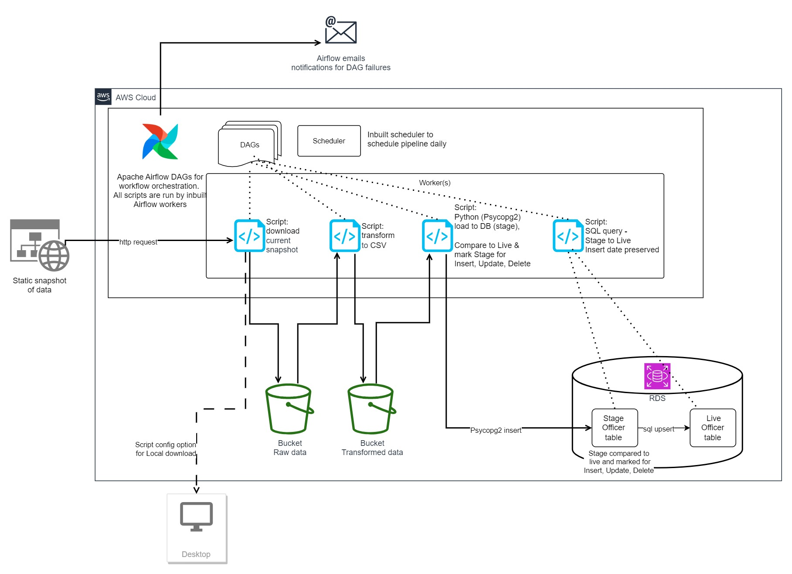

# ETL Infrastructure Diagram

The proposed infrastructure to run this ETL is displayed in this [diagram](#diagram) below

## Overview

The proposition involves using Airflow in AWS (optionally the AWS hosted implementation).  DAG scripts will be run by the Airflow workers and do the following:
- download the static file to a cloud bucket (or local machine for dev purposes):
- transform the file and place it into a new cloud bucket for processed data along with timestamps
- read the latest transformed file and insert this data into a Stage table within a cloud Database, then compare the stage table to the Live table so records are marked for INSERT, UPDATE, DELETE.
- run a series of queries to INSERT, UPDATE, DELETE data into the Live DB table - this allows COU

## Advantages:

- The inbuilt scheduler within an Airflow implementation allows daily scheduling
- Airflow enables email alerts for successful or failed pipeline runs
- Airflow's workers can run the DAG scripts
- Separate buckets for raw and transformed data keeps an audit trail of what data has been processed - this can be moved to cheap archived bucket like S3 Glacier
- Staging tables in the database are useful for two main reasons - by only applying change only updates, this reduces the operations impacting the live database which reduces the locks on 

## Disadvantages:

- Airflow is a relatively complex solution for a simple pipeline - however the added benefits of scheduling, logging, notifications might outweigh this
- Airflow needs to have the computational capacity for the Worker nodes to run the DAG scripts, if the data download is quite large, it might be more sensible to have serverless functions called/orchestrated by Airflow rather than having redundant processing capacity on the Airflow server at all times.
- Currently, the diagram holds staging tables and live tables within the same database - if the data being upserted is not large quantities, it might be simpler to run transactions to the live database directly 

## Diagram

